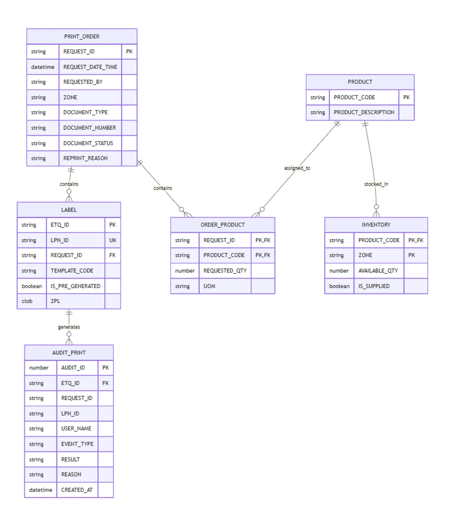
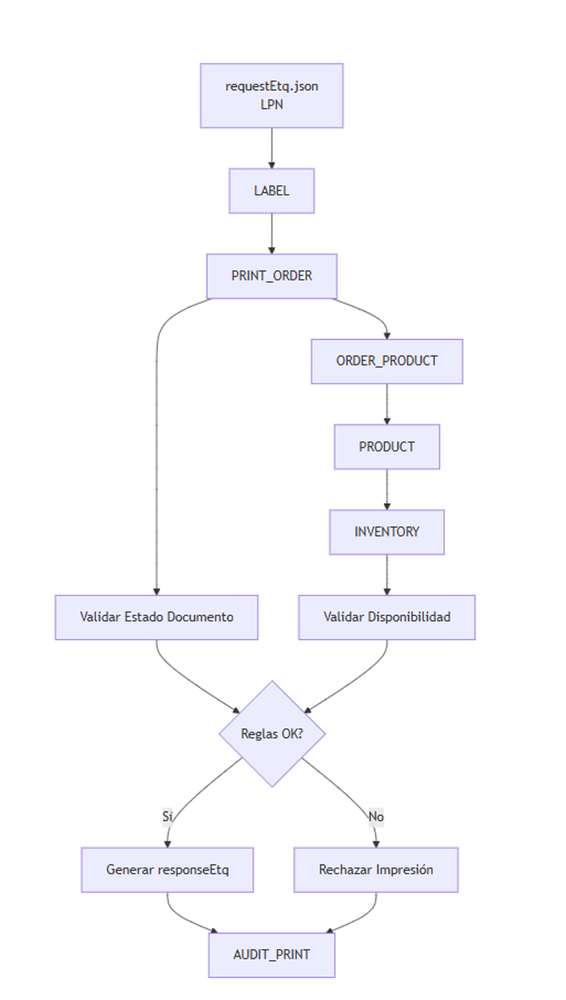
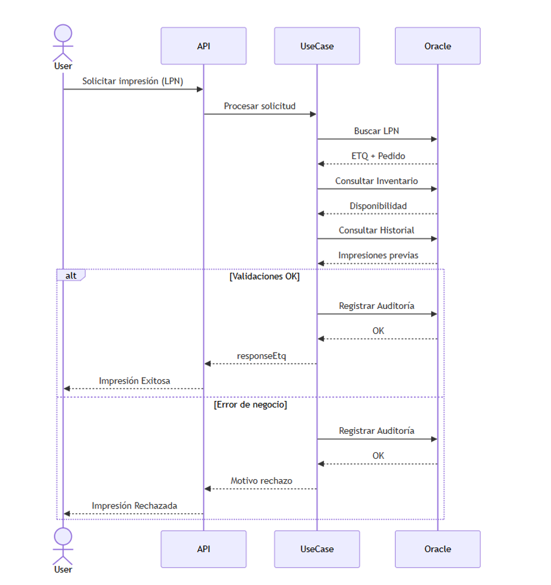
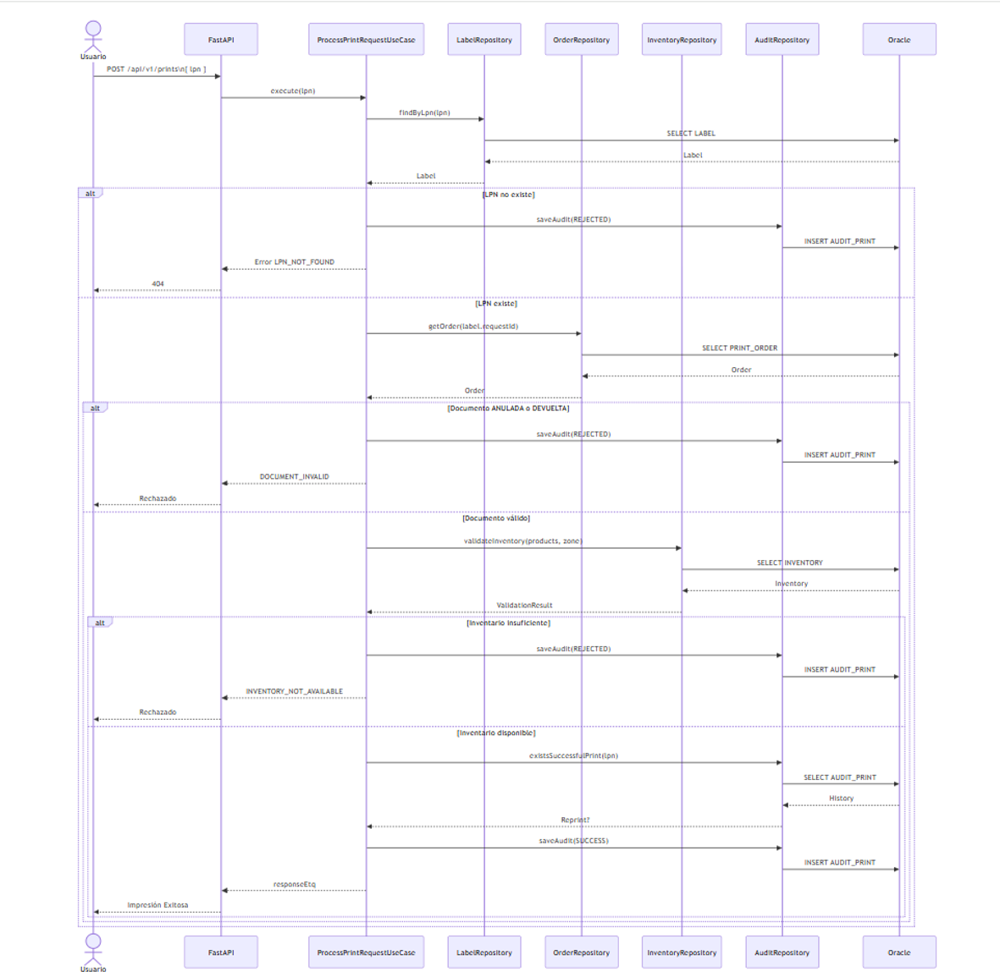

# Project Details (from pyproject.toml)

- Name: ETQ_PRINT_API_PY
- Version: 1.0.0
- Description: Servicio encargado del submódulo de impresión de ETQ.
- Python Version: >=3.13
- Dependencies: FastAPI, SQLAlchemy, python-dotenv, sqlite, etc.

---

# Diagrams
This section contains the technical diagrams that describe the architecture, data model, and business flow of the application.

# Entity Relationship Diagram (ER)

The Entity Relationship Diagram illustrates the database structure, including entities, attributes, and relationships used by the ETQ printing service.


# Process Flow Diagram
The Process Flow Diagram describes the end-to-end workflow of the label printing process, including request validation, business rules execution, and response generation.



# Sequence Diagram
The Sequence Diagram illustrates the interaction between clients, API endpoints, business services, repositories, and the database during a label printing request.




# Getting Started 
Follow these instructions to get your code up and running on your local system.

# Installation
To get started, you'll need Python >=3.13 (or the latest version available). You can use Poetry to manage dependencies and virtual environments.

1.	Step 1: Clone the repository

```bash
mkdir workspace
cd workspace

git clone https://github.com/br2bb7t/ETQ_PRINT_API_PY

cd ETQ_PRINT_API_PY
```

2.	Step 2: Install dependencies

```bash
poetry env activate
```
```bash
poetry install
```
This will install all required libraries from pyproject.toml, including FastAPI, SQLAlchemy.

3.	Step 3: Set up environment variables
4.	Step 4: Running the Application

```bash
poetry run uvicorn api.main:app --reload --host 0.0.0.0 --port 8080
```
This will start the application on http://127.0.0.1:8080.


# Build and Test
We use pytest for testing. To run tests, simply execute the following command:

```bash
poetry run pytest
```
This will run all the unit tests in the tests directory. You can also run tests with coverage reporting by using:

```bash
poetry run pytest --cov=. --cov-report=html; start htmlcov\index.html
```

# Code Formatting
This project uses black and isort for code formatting and import sorting, respectively. You can run the formatter with:

```bash
poetry run isort .; poetry run black .   
```

# API Reference

This project uses **FastAPI**, which automatically generates interactive API documentation using **Swagger UI** and **ReDoc**.

Once the app is running, you can access the API docs at:

- Swagger UI: [http://127.0.0.1:8080/docs](http://127.0.0.1:8080/docs)
- ReDoc: [http://127.0.0.1:8080/redoc](http://127.0.0.1:8080/redoc)

These interfaces allow you to explore and test the available API endpoints interactively.
